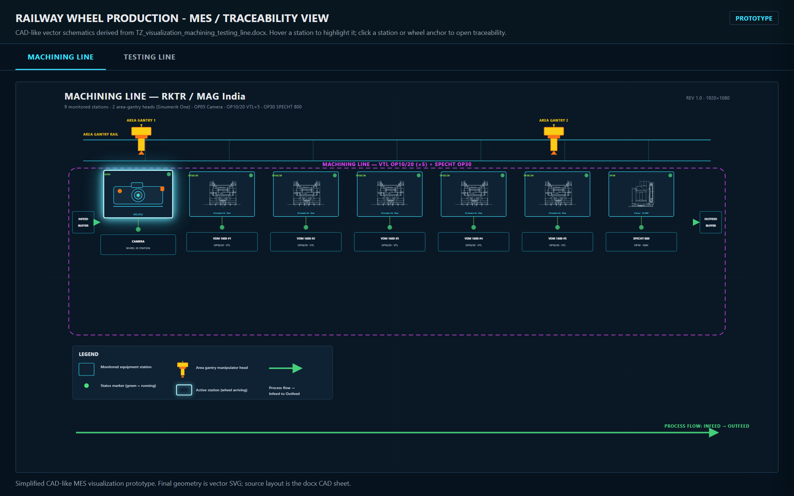

# Визуализация производственной линии RKTR

Интерактивная визуализация производственной линии изготовления железнодорожных
колёс для системы MES и сквозной прослеживаемости детали (line traceability).

Прототип отображает два участка линии — **Machining line** (механообработка) и
**Testing line** (контроль и испытания) — в виде CAD-подобных схем, на которых в
реальном времени показаны статус оборудования, движение манипуляторов, перемещение
детали по операциям и полная карточка прослеживаемости по клику на колесо или станцию.

- Заказчик: RKTR — Ramkrishna Titagarh Rail Wheels Ltd (Ченнаи, Индия)
- Интегратор линии: MAG India (FFG Europe & Americas)
- Программное решение: MDC Plus



## Возможности

- **Две линии в одном приложении** — переключение между Machining line и Testing
  line; схемы построены по фактической геометрии и составу оборудования.
- **Статус оборудования** — цветовая индикация состояния каждой станции
  (работает, внимание, остановлено, простой).
- **Карточка прослеживаемости** — клик по станции или колесу открывает popup со
  всеми обязательными полями: код изготовления, дата клеймения, код плавки,
  серийный номер, операция, ID станка, контроллер, статус OK/NotOK, тип детали,
  габариты и процессные параметры.
- **Wheel drawer** — боковая панель с идентификацией колеса, текущей позицией и
  полным маршрутом по линии (пройденные, текущая и предстоящие операции с отметками
  времени).
- **Панель процессных параметров** — 262 параметра по 14 единицам оборудования,
  сведённые из инженерной спецификации.
- **Анимация манипуляторов** — gantry-головки перемещаются по событиям вида
  «деталь с серийным номером X переместилась из зоны A в зону B». Манипуляторы
  работают параллельно, как в реальном цехе.
- **Единая точка интеграции с PLC** — функция `acceptPlcEvent(...)` является
  единственным входом для реального адаптера PLC/SCADA. В прототипе поток событий
  имитируется встроенным mock-PLC.

## Запуск

Приложение использует `fetch` для загрузки SVG-схем, поэтому его нужно открывать
через локальный HTTP-сервер, а не как файл `file://`.

С помощью Python:

```bash
python -m http.server 8000
```

Либо с помощью Node.js:

```bash
npx serve
```

После запуска откройте в браузере:

```
http://localhost:8000/
```

Сборка и backend не требуются — это статическое браузерное приложение.

## Структура проекта

```
